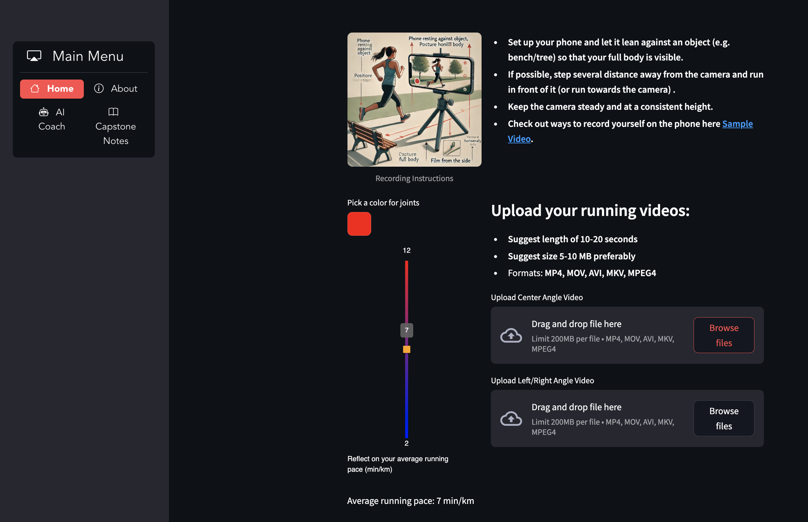
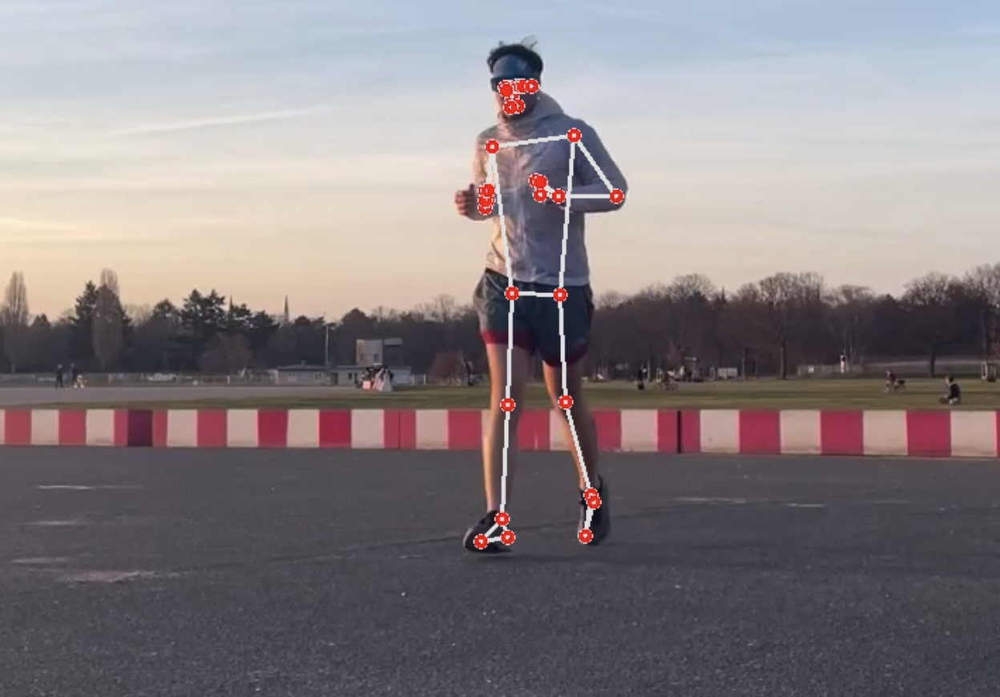

# 🏃‍♂️ AI Running Coach 

A live demo of **AI Running Coach** in action for **CP194**!  
Using advanced **pose estimation** with **Google MediaPipe**, this tool **analyzes running form in real-time, classifies running styles, and provides useful insights** to help runners optimize their technique.  

## 🎯 Key Features  
✅ **Real-time body tracking** Detects **33+ key body points** to analyze posture and movement.   
✅ **Running style classification** Categorizes runners into different styles based on form and efficiency (Eco Sprinter, Quick Stepper, etc.) 

✅ **Insights on running economy parameters** Provides feedback and data-analysis

## 🖼️ Project Dashboard and Snapshot  
  




## 🛠️ Tech Stack  
- **Pose Estimation:** Google MediaPipe  
- **Languages:** Python  
- **Frameworks:** Streamlit, OpenCV, NumPy  
- **Data Visualization:** Matplotlib, Pandas  
- **Deployment:** Streamlit Cloud  

## 📸 Live Demo  
🎥 **Watch AI Running Coach in Action!** 👉 [**YouTube Demo**](https://youtu.be/iKnkPSCsl9g)  

[](https://youtu.be/iKnkPSCsl9g)

## 🔧 Installation & Running the Code  
```bash
# 1️⃣ Clone the Repository  
git clone https://github.com/yourusername/ai_running_coach.git
cd ai_running_coach

# 2️⃣ Run the App with Streamlit  
streamlit run app.py
